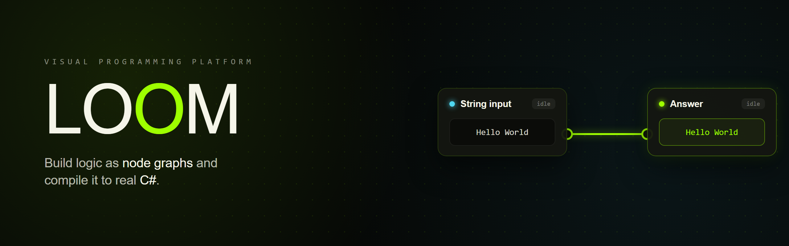
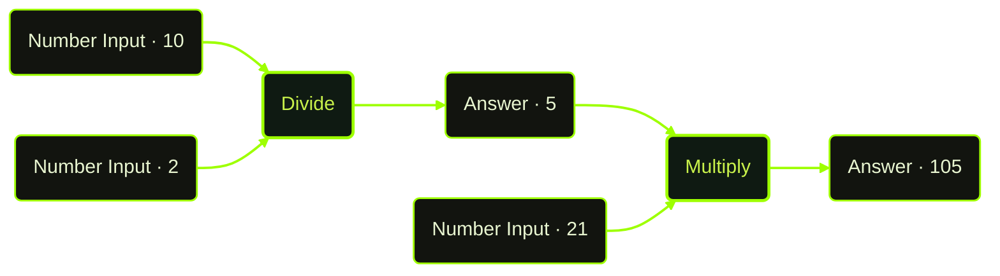

<div align="center">



# LOOM

### A node-based platform that turns visual workflows into real C# code

[](https://dotnet.microsoft.com/)
[](https://learn.microsoft.com/aspnet/core/blazor/)
[](https://learn.microsoft.com/dotnet/csharp/)

**[🚀 Try it live](https://loom.runasp.net/)**  **[⚡ How it works](#-how-it-works)**

</div>

---

## ✨ Overview

Understanding program logic through raw source code alone is hard — especially for learners and teams reasoning about C# workflows. **LOOM** is a node-based web application that represents C# program logic visually, on an interactive drag-and-drop canvas.

You model **inputs, operations, and data flow** as connected nodes, run the graph to see live results, and **export the whole thing to clean, runnable C#**. The visual graph *is* the program — bridging code-centric development with visual programming for students, educators, and developers.

Built on **ASP.NET Core (.NET 8)** with a **Blazor Server** frontend and a modular backend service layer.


---

## 🧩 Features

| | |
|---|---|
| 🎨 **Node-based canvas** | Drag-and-drop workspace for composing logic as connected nodes. |
| 🔌 **Typed ports & connections** | Wire an output port to an input port to define data flow; connections are validated. |
| ⚡ **Live execution** | Run a workflow and watch each node evaluate in place — with visible state (idle → running → done). |
| 🧾 **C# code export** | Generate readable, runnable C# from any graph — your visual logic as real source. |
| ✅ **Validation** | Workflows are checked for correctness before they run. |
| 💾 **Persistence** | Save, load, and revisit workflows; share them as `.loom` projects. |
| 🔐 **Authentication** | Sign in with **Google** or **GitHub**. |
| ☁️ **Cloud-hosted** | Runs entirely in the browser — live at [loom.runasp.net](https://loom.runasp.net/). |

**Node library includes:** Number Input · String Input · math operations (Add, Subtract, Multiply, Divide) · Answer · Printer.

---

## ⚡ How It Works

Every workflow is just nodes wired together. Here's a real one — computing `(10 ÷ 2) × 21 = 105`:



| Step | What happens |
|:--:|---|
| **1 · Compose** | Drop nodes onto the canvas — each exposes typed input/output **ports**. |
| **2 · Connect** | Drag between ports to define how data flows; LOOM validates the connection. |
| **3 · Run** | The engine evaluates the workflow in dependency order and shows each result live. |
| **4 · Export** | The same graph is translated into an equivalent, runnable **C#** program. |

<details>
<summary><b>▶ See the C# this graph exports</b></summary>

<br>

```csharp
// Generated by LOOM
// calculator.loom

double a = 10;
double b = 2;
double c = 21;

double quotient = a / b;       // Divide  → Answer  (5)
double product  = quotient * c; // Multiply → Answer (105)
```
</details>

---

## 🏗️ Architecture

LOOM is organized around a small, composable domain model:

| Component | Role |
|---|---|
| **Node** *(abstract base)* | Common contract for every node; concrete types (Number Input, Multiply, Answer, Printer, …) extend it. |
| **Port** | Typed input/output connection point on a node. |
| **Connection** | A directed link from one node's output port to another's input port. |
| **Workflow** | The full graph — nodes + connections — that gets validated, executed, and exported. |

```
Blazor Server (UI · canvas · node editor)
        │
        ▼
Backend service layer  →  validation · execution engine · C# code generation · persistence
```

---

## 🚀 Getting Started

### Use it now
No setup required — open **[loom.runasp.net](https://loom.runasp.net/)** and sign in with Google or GitHub.

### Run locally

**Prerequisites:** [.NET SDK 8.0+](https://dotnet.microsoft.com/download)

```bash
git clone https://github.com/Loom-Dev-2026/LOOM.git
cd LOOM
dotnet restore
dotnet run
```

Open the URL printed in the console (typically `https://localhost:5001`).

> **Auth & cloud sync** need OAuth credentials. Add them via user secrets — without them, LOOM still runs fully for building, executing, and exporting workflows locally:
> ```bash
> dotnet user-secrets set "Authentication:Google:ClientId" "..."
> dotnet user-secrets set "Authentication:Google:ClientSecret" "..."
> dotnet user-secrets set "Authentication:GitHub:ClientId" "..."
> dotnet user-secrets set "Authentication:GitHub:ClientSecret" "..."
> ```

---

## 🗺️ Roadmap

- [ ] Expanded node library (control flow, conditions, collections, I/O)
- [ ] Reusable sub-graph / custom nodes
- [ ] Real-time collaboration on a shared canvas
- [ ] Additional export targets beyond C#

---

## 👥 Authors

Built for the **Visual Programming** course, Department of Computer Science.

- **Tasnima Sajid** — [GitHub](https://github.com/TasnimaSajid) · [LinkedIn](https://www.linkedin.com/in/tasnima-sajid-b37563421/)
- **Ali Tahir**

<sub>Supervised by Sir Hafiz Ubaidullah · Spring 2026</sub>

---

## 📄 License

Released under the MIT License — see [`LICENSE`](LICENSE) for details.

<div align="center">
<br>

**Built with Blazor & .NET** · **[loom.runasp.net](https://loom.runasp.net/)**

</div>
